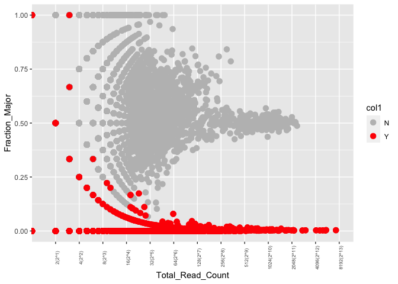

# stmut user guide — scripts of figures and tables for the manuscript.

------------------------------------------------------------------------

stmut was developed for analyses of 10x spatial transcriptomics data
when preparing the
[manuscript](place%20holder%20for%20the%20manuscirpt). All the input
tables were provides [here](./ExampleTables/). We provide a subset of
each input table, as a reference for you to set your input format
accordingly.

This instruction provides an example of how to perform CNVs, point
mutation, and allelic imbalance of 10x spatial transcriptomics data.

## load packages

------------------------------------------------------------------------

    library(dplyr)
    library(ggplot2)
    library(tidyr)
    library(stringr)
    library(data.table) # for string partially match 
    library(tibble)
    library(readxl)
    library(stmut)
    library(pheatmap)

    # packages for siCNV
    library(devtools)
    library(tidyverse)
    library(Seurat)
    library(ape)
    library(phylogram)
    library(hdf5r)
    library(infercnv)
    library(SpatialInferCNV)

## Table S1

------------------------------------------------------------------------

Supplementary tableS1 – patient4 and patient6 bulk somatic mutations
list

    p4 <- read.table("./BulkDNASeq/mutations/somaticMML.txt", sep = "\t", header = TRUE, quote = "")
    p6 <- read.table("./BulkDNASeq/mutations/somaticMML.txt", sep = "\t", header = TRUE, quote = "")
    p4 <- p4[-1,]
    p6 <- p6[-1,]
    df <- rbind(p4,p6)
    Patient <- c(rep("Patient 4", dim(p4)[1]), rep("Patient 6", dim(p6)[1]))

    df1 <- cbind(Patient, df)
    df1$Start_Position <- as.character(df1$Start_Position)
    df1$End_Position <- as.character(df1$End_Position)
    df1$dbSNP_RS <- as.character(df1$dbSNP_RS)

    # tumor allele frequency
    d4 <- read.csv("./Patient4/BulkDNASeq/mutations/AJ-03_Pass_Filter_MasterMutationList.csv", header = TRUE, sep = ",", comment.char = "#")
    d4 <- d4 %>% filter(Hugo_Symbol %in% p4$Hugo_Symbol)
    d4 <- d4[-1,]
    d6 <- read.csv("./Patient6/BulkDNASeq/mutations/AJ-05_Pass_Filter_MasterMutationList.csv", header = TRUE, sep = ",", comment.char = "#")
    d6 <- d6 %>% filter(d6$Hugo_Symbol %in% p6$Hugo_Symbol)

    UV <- c(d4$UV, d6$UV)
    Tumor_Ref <- c(d4$Tumor_Ref, d6$Tumor_Ref)
    Tumor_Mut <- c(d4$Tumor_Mut, d6$Tumor_Mut)
    Tumor_MAF <- c(d4$Tumor_MAF, d6$Tumor_MAF)

    patho <- read_excel("./ST_paper/tabels/TableS1_pathogenicMarked.xlsx")
    patho <- patho[-1,]
    Pathogenic_Mutations <-patho$Pathogenic_Mutations
    df0 <- data.frame(UV,Pathogenic_Mutations, Tumor_Ref, Tumor_Mut, Tumor_MAF)
    df1 <- cbind(df1,df0)

    # add ref and mutant column of Spatial Transcriptomics data to bulk data df1.
    p41 <- read.delim("./Patient4/SpatialTranscriptomic/Rep1/PointMutation/AllSpots/mpileupOutput/MpileupOutput_RNA_allSpots.txt",sep = "\t", header = FALSE)
    p41[1,9] <- "Ref1"
    p41[1,10] <- "Mut1"
    colnames(p41) <- p41[1,]
    p41 <- p41[-1,]
    p61 <- read.delim("./Patient6/SpatialTranscriptomic/Rep1/PointMutation/AllSpots/mpileup/MpileupOutput_RNA.txt", sep = "\t", header = FALSE)
    p61[1,9] <- "Ref1"
    p61[1,10] <- "Mut1"
    colnames(p61) <- p61[1,]
    p61 <- p61[-1,]
    rep1 <- rbind(p41,p61)
    rep1 <- rep1[,c(1,9,10)]
    p42 <- read.delim("./Patient4/SpatialTranscriptomic/Rep2/PointMutation/AllSpots/mpileup/MpileupOutput_RNA.txt", sep = "\t", header = FALSE)
    p42[1,9] <- "Ref2"
    p42[1,10] <- "Mut2"
    colnames(p42) <- p42[1,]
    p42 <- p42[-1,]
    p62 <- read.delim("./Patient6/SpatialTranscriptomic/Rep2/PointMutation/AllSpots/mpileup/MpileupOutput_RNA.txt", sep = "\t", header = FALSE)
    p62[1,9] <- "Ref2"
    p62[1,10] <- "Mut2"
    colnames(p62) <- p62[1,]
    p62 <- p62[-1,]
    rep2 <- rbind(p42,p62)
    rep2 <- rep2[,c(1,9,10)]
    df3 <- cbind(df1,rep1)
    df4 <- cbind(df3,rep2)
    df5 <- df4[,-c(20, 23)]

# Spatial Spot Point Mutation

------------------------------------------------------------------------

## Figure 1.; Figure 2A.

    #step1
    files1 <- list.files(path="./Patient4/SpatialTranscriptomic/Rep1/PointMutation/AllSpots/spotIndex", pattern = ".txt", full.names = TRUE, recursive = FALSE)
    data1 <- read.csv("./Patient4/SpatialTranscriptomic/Rep1/Data/SpacerangerOutput/CloupeFilesManualAlignment/filtered_feature_bc.csv", header = TRUE)
    data2 <- read.csv("./Patient4/SpatialTranscriptomic/Rep1/Data/SpacerangerOutput/CloupeFilesManualAlignment/Graph-Based.csv", header = TRUE)
    path <- "./Patient4/SpatialTranscriptomic/Rep1/Data/SpacerangerOutput/CloupeFilesManualAlignment/spatial/tissue_positions_list.csv"
    files2 <- list.files(path = "./Patient4/SpatialTranscriptomic/Rep1/PointMutation/AllSpots/mpileup", pattern = "MpileupOutput_RNA.txt", full.names = TRUE, recursive = TRUE, include.dirs = TRUE)
    path1 <- "./Patient4/SpatialTranscriptomic/Rep1/PointMutation/AllSpots/mpileup/"

    spaPointMutation(files1 = files1, files2 = files2, data1 = data1, data2 = data2, path = path, path1 = path1)

## Figure 2B -patient 4 :Generate table for tiling plot to visualize which somatic mutation co-occurred across spots.

    rep1 <- read.csv("./Patient4/SpatialTranscriptomic/Rep1/PointMutation/AllSpots/mpileupOutput/MutantSpotIndex_Scored.csv", header = TRUE)
    rep1 <- rep1[,c("spot","GenesWithMutRead")]
    rep1$spot <- paste0("rep1_",rep1$spot)
    rep2 <- read.csv("./Patient4/SpatialTranscriptomic/Rep2/PointMutation/AllSpots/mpileup/MutantSpotIndex_Scored.csv", header = TRUE)
    rep2 <- rep2[,c("spot","GenesWithMutRead")]
    rep2$spot <- paste0("rep2_",rep2$spot)

    # create row and column information
    t1 <- rep1$spot
    genes <- c()
    for (e in t1){
      gen <- rep1[match(e,rep1$spot),2]
      gs <- str_split(gen, pattern = ";", simplify = TRUE)
      genes <- append(genes,gs)
    }
    t2 <- rep2$spot
    for (e in t2){
      gen <- rep2[match(e,rep2$spot),2]
      gs <- str_split(gen, pattern = ";", simplify = TRUE)
      genes <- append(genes,gs)
    }
    g2 <- unique(genes)
    g1 <- unique(genes)
    g <- c(g1,g2)

    # how many final rows
    x <- unique(genes)
    y <- x[-match("",x)]
    # create the dataframe
    cNames <- c("GenWithMut",rep1$spot, rep2$spot)
    c <- length(cNames)
    df <- data.frame(matrix(nrow = length(y),ncol = c))
    colnames(df) <- cNames
    df$GenWithMut <- y

    # fill out df, if the mutant gene present in that spot, fill "1", otherwise, fill "0"
    for (e in t1){
      gen <- rep1[match(e,rep1$spot),2]
      gs <- str_split(gen, pattern = ";", simplify = TRUE)
      n <- length(gs)-1
      for (i in 1:n){
        rIdx <- match(gs[i],df$GenWithMut)
        df[rIdx,e] <- 1
      }
    }

    for (e in t2){
      gen <- rep2[match(e,rep2$spot),2]
      gs <- str_split(gen, pattern = ";", simplify = TRUE)
      n <- length(gs)-1
      for (i in 1:n){
        rIdx <- match(gs[i],df$GenWithMut)
        df[rIdx,e] <- 1
      }
    }

    df[is.na(df)] <- 0

    # Reorder the df (saved as cdt file) for JavaTree visualization. First, count the number of mutations in each row; Second, sort top to bottom so that the rows were arranged by the number of mutations (highest at the top and lowest at the bottom); Third, sort left to right for each row so that the samples with mutations clustered to the left within each row.
    df4 <- df
    # add an index column to maintain the gene name order. 
    spt <- seq(-dim(df4)[1])[-1][-1]
    df4 <- cbind(spt, df4) # add a colum to replace gene name
    od <- df4[,c(1,2)] # save gene name and index column for later use.
    df4 <- df4[,-2] #remove gene name column

    df4$rS <- rowSums(df4) # count rowSum for each row
    df4$rS <- df4$rS - df4$spt
    df5 <- df4[order(df4$rS, decreasing = TRUE),] # sorting by the rowSum
    df5 <- df5[,-164] # remove the rowSum column

    # sort by columns, because I only know how to sort by row in r so I transpose the original columns to rows
    df6 <- data.frame(t(df5))
    df7 <- df6[do.call(order,c(df6, list(decreasing=TRUE))),]
    df8 <- data.frame(t(df7))
    df9 <- merge(df8,od, by="spt",sort = FALSE)
    df8 <- df9[,-1]

    CLID <- c("IMAGE:0", paste0("IMAGE:", seq(dim(df8)[1]-1)))
    d1 <- data.frame(CLID, df8$GenWithMut)
    d2 <- df8[,-163]
    dfinal <- cbind(d1,d2)
    name <- names(dfinal)
    colnames(dfinal) <- replace(name, name=="df8.GenWithMut","NAME")

    #write.table(dfinal,file="/Users/limin/limin_practice/p4.cdt", sep = "\t", quote = FALSE, row.names = FALSE)

Then manually move some rows order to make the visualization more
organized for patient 4 of p4.cdt.

# Copy Number Variations (CNVs)

------------------------------------------------------------------------

## Bulk CNVs; Figure S1.

    cnr <- read.table("/Volumes/Bastian/Limin/Ji_data/Patient6/BulkDNASeq/CNV/P6_T.deduplicated.realign.cnr", sep = "\t", header = TRUE)
    cns <- read.table("/Volumes/Bastian/Limin/Ji_data/Patient6/BulkDNASeq/CNV/P6_T.deduplicated.realign.cns", sep = "\t", header = TRUE)
    centromere <- read.table("/Volumes/Bastian/Limin/reference/hg19/Centromere.bed")

    bulkCNVs(centmere = centromere, dcnr = cnr, dcns = cns)

    ## Warning: Removed 3373 rows containing missing values (geom_point).

    ## Warning: Removed 12 rows containing missing values (geom_segment).

## Spatial Spot CNVs;

Group low coverage spots from the same gene expression cluster.

    # c1 is the subset of the output of the sptBClstRds() function.
    c1 <- read.csv(system.file("extdata/", "c1.csv", package = "stmut"),header = TRUE)
    df10 <- groupSpots(data = c1, Treads=5000, NumSpt=6) 

## Figure 3.

-   step 1: group spots. In this case, we have 2 replicates, and group
    spots for each rep.

<!-- -->

    df0 <- read.csv("./Rep1/CopyNumber/AllSpots/sptBcSummary.csv") # rep1
    data0 <- read.csv("./Rep1/Data/SpacerangerOutput/CloupeFilesManualAlignment/filtered_feature_bc.csv")
    locpath <- "./Rep1/Data/SpacerangerOutput/CloupeFilesManualAlignment/spatial/tissue_positions_list.csv"

    spotsGrouped(df1=df0, Treads = 5000, NumSpt=8, data=data0, locpath=locpath )

    df2 <- read.csv("./Rep2/CopyNumber/AllSpots/sptBcSummary.csv") # rep2
    data2 <- read.csv("./Rep2/Data/SpacerangerOutput/CloupeFilesManualAlignment/filtered_feature_bc.csv")
    locpath <- "./Rep2/Data/SpacerangerOutput/CloupeFilesManualAlignment/spatial/tissue_positions_list.csv"

    spotsGrouped(df1=df2, Treads = 5000, NumSpt=8, data=data2, locpath=locpath )

outputs of spotsGrouped(). 

-   step 2: generate the cnr file by running
    [cnvkit](https://www.youtube.com/watch?v=JGOIXYoLG6w&t=747s).

<!-- -->

    # DERM-6NBQ05N-LT cnr % cnvkit.py import-rna -f counts -g /Users/limin/miniconda3/envs/cnvkit/data/ensembl-gene-info.hg38.tsv -c /Users/limin/miniconda3/envs/cnvkit/data/tcga-skcm.cnv-expr-corr.tsv -o output.txt ../txt/*.txt

-   step 3: generate weighted arm-based cnr file for each cnr file.
-   step 4: generate cdt file.

<!-- -->

    cnrs <- list.files(path = "/Volumes/Bastian/Limin/Ji_data/ST_paper/rFunctions/p6/cnr", pattern = ".cnr", full.names = TRUE, recursive = FALSE)
    parallel::mclapply(cnrs, function(x){
       cnr <- read.table(x, header = TRUE)
      sptNs <- str_split(x, "/", simplify = TRUE)
      sptN <- sptNs[length(sptNs)]
      centm <- read.table("/Volumes/Bastian/Limin/reference/hg38_centromereSimple.bed")
      df <- wtArmMedianOne(data = cnr,centmere = centm)
      # write.table(df[[1]], file = paste0("/Volumes/Bastian/Limin/Ji_data/ST_paper/rFunctions/p6/wtcnr/",sptN), row.names = FALSE, col.names = TRUE, quote = FALSE, sep = "\t")
      #write.table(df[[2]], file = "/Volumes/Bastian/Limin/Ji_data/ST_paper/rFunctions/p6/wtcnr/summary.txt", row.names = FALSE, col.names = TRUE, quote = FALSE, sep = "\t")
    }, mc.cores = 3)

    # DERM-6NBQ05N-LT cdt % cnvkit.py export cdt ../wtcnr/*.cnr -o ../p6grpWt.cdt

## NOTE: for your own data, instead of using `cnvsorted`, please run `cnvs()` function as shown on the main page to center the cdt file from step 4.

-   step 5: sort cdt file. In our case, there are 2 replicates. The
    sorted cdt file is saved to your working dir.

<!-- -->

    r1 <- read.csv("/Volumes/Bastian/Limin/Ji_data/ST_paper/rFunctions/CNVs1/newSpotSummary.csv")
    r1$spot <- paste0("spot", (as.numeric(substr(r1$spot,5,nchar(r1$spot)))+1))
    r1$rep <- rep("rep1", nrow(r1))
    r1$sptRep <- paste0(r1$spot,"_rep1")
    r1$final <- paste0(r1$spot,"_rep1_",r1$cluster)
    r2 <- read.csv("/Volumes/Bastian/Limin/Ji_data/ST_paper/rFunctions/CNVs2/newSpotSummary.csv")
    r2$spot <- paste0("spot", (as.numeric(substr(r2$spot,5,nchar(r2$spot)))+1))
    r2$rep <- rep("rep2", nrow(r2))
    r2$sptRep <- paste0(r2$spot,"_rep2")
    r2$final <- paste0(r2$spot,"_rep2_",r2$cluster)
    r <- rbind(r1,r2)
    r <- r[,c("sptRep","final","rep","cluster","TotalRDs")]

    cdt <- read.table("/Volumes/Bastian/Limin/Ji_data/ST_paper/rFunctions/p6/cdt/p6grpWt.cdt", sep = "\t", header = TRUE)
    data <- read.table("/Volumes/Bastian/Limin/Ji_data/ST_paper/rFunctions/p6/wtcnr/summary.txt", sep = "\t", header = TRUE)
    arm <- c("1p","3p","3q","4q","5q","8q","9q","10p","10q","11q","13p","13q","20p","20q","21q","14q","17q") # FigS1
    gainLoss <- c(1,-1,1,-1,-1,1,1,-1,-1,1,-1,-1,1,1,-1,1,1)
    tumorclusters <- c("rep1_Cluster1$|rep1_Cluster5|rep2_Cluster7|rep2_Cluster4")

    cnvsorted(data1 = r, cdt = cdt, data = data, arm = arm, gainLoss = gainLoss, tumorclusters = tumorclusters)

CNVs\_sorted.cdt is generated.  the
CNVs\_sorted.cdt is the spot CNVs data matrix, which can be visualized
either in JavaTreeview to make Figure3 or in R as following:

    cdt <- read.table(file = "/Volumes/Bastian/Limin/Ji_data/ST_paper/mergedP6/cdt/p6NonTumMedianCNVsorted.cdt", sep = "\t", header = TRUE, quote = "")
    rownames(cdt) <- cdt[,2]
    cdt <- cdt[,-c(1,2)]
    pheatmap(cdt,
             cluster_rows = FALSE, 
             cluster_cols = FALSE,
             fontsize_col = 0.5, # can't be < 0.5, labels disappear.
             fontsize_row = 0.5,
             color = colorRampPalette(c("blue", "white", "white","red"))(18))

## Figure S3B.; patient 4–tables for tumor, no tumor, no tissue regions

    # patient 4 rep1
    r1 <- read.csv("/Volumes/Bastian/Limin/Ji_data/ST_paper/nonTissue_heatmap/tumor_regions/regionAutoalinRep1.csv", header = TRUE)
    r1[r1==""]<- "nonTissue"
    data <- read.csv("/Volumes/Bastian/Limin/Ji_data/Patient4/SpatialTranscriptomic/Rep1/Data/SpacerangerOutput/CloupeFilesAutoAlignment/filtered_feature_bc.csv", header = TRUE)
    data <- data[,-1]
    data1 <- data.frame(names(data), colSums(data))
    colnames(data1) <- c("Barcode", "reads")
    data1$Barcode <- str_replace(data1$Barcode, ".1", "-1")

    rep1 <- merge(r1, data1, by = "Barcode")
    for (rg in unique(rep1$tumor)){
      df <- rep1 %>% filter(tumor == rg)
      med <- median(df$reads)
      print(paste0(rg, " median reads is ", med))
    }

    ## [1] "tumor median reads is 21613.5"
    ## [1] "nonTissue median reads is 304"
    ## [1] "nonTumor median reads is 8545.5"

    # add 0s to spots with 0 reads.
    dr1 <- rep1 %>% filter(tumor == "nonTissue")
    v3 <- c(dr1$reads, rep(0, 1056))
    median(v3)

    ## [1] 212

    # patien4 rep2
    r2 <- read.csv("/Volumes/Bastian/Limin/Ji_data/ST_paper/nonTissue_heatmap/tumor_regions/regionAutoalinRep2.csv", header = TRUE)
    r2[r2==""]<- "nonTissue"
    data2 <- read.csv("/Volumes/Bastian/Limin/Ji_data/Patient4/SpatialTranscriptomic/Rep2/Data/SpacerangerOutput/CloupeFilesAutoAlignment/outs/filtered_feature_bc.csv", header = TRUE)
    data2 <- data2[,-1]
    data3 <- data.frame(names(data2), colSums(data2))
    colnames(data3) <- c("Barcode", "reads")
    data3$Barcode <- str_replace(data3$Barcode, ".1", "-1")

    rep2 <- merge(r2, data3, by = "Barcode")
    for (rg in unique(rep2$tumor)){
      df <- rep2 %>% filter(tumor == rg)
      med <- median(df$reads)
      print(paste0(rg, " median reads is ", med))
    }

    ## [1] "nonTissue median reads is 215"
    ## [1] "tumor median reads is 25201"
    ## [1] "nonTumor median reads is 9157.5"

    # combined median
    for (rg in unique(rep2$tumor)){
      df1 <- rep1 %>% filter(tumor == rg)
      df2 <- rep2 %>% filter(tumor == rg)
      med <- median(c(df1$reads,df2$reads))
      print(paste0(rg, " median reads is ", med))
    }

    ## [1] "nonTissue median reads is 248"
    ## [1] "tumor median reads is 23284"
    ## [1] "nonTumor median reads is 9000"

    # tissue median
    df1 <- rep1 %>% filter(tumor != "nonTissue")
    df2 <- rep2 %>% filter(tumor != "nonTissue")
    d <- c(df1$reads, df2$reads)
    median(d)

    ## [1] 16709

    d1 <- rep1 %>% filter(tumor == "nonTissue")
    d2 <- rep2 %>% filter(tumor == "nonTissue")
    nonTis <- c(d1$reads, d2$reads, rep(0,4992-3936)) 
    median(nonTis)

    ## [1] 213

    # barplot of mutant spots/mm2 for the benign tissue and the no tissue. and add confidence intervals
    tis <- c("Benign Tissue", "No Tissue")
    val <- c(1.45, 0.15)
    CIl <- c(0.6939781,0.07590766)
    CIh <- c(2.6614119,0.27207684)

    df <- data.frame(tis, val, CIl, CIh)

    ggplot(data=df, aes(x=tis, y=val)) +
      geom_bar(stat = "identity", width = 0.5)+
      geom_errorbar(aes(ymin=CIl, ymax=CIh), colour="black", width=.05, position = "identity")+
      xlab("Capture Area") +
      ylab("Mutations/mm2") + 
      theme(aspect.ratio = 2/1) 

    #ggsave("/Volumes/Bastian/Limin/Ji_data/ST_paper/nonTissue_heatmap/tumor_regions/mutationCI.pdf")

## Figure S4

    cdt0 <- read.table("/Volumes/Bastian/Limin/Ji_data/ST_paper/mergedP6/cdt/p6NonTumMedianCNVsorted1.cdt", sep = "\t", header = TRUE)
    ArmGenSumm <- read.csv("/Volumes/Bastian/Limin/Ji_data/ST_paper/mergedP6/cdt/CtArmGenSummary.csv", header = TRUE)
    # sort the spots based on the CNV signal found in the bulk data
    arm <- c("1p","3p","3q","4q","5q","8q","9q","10p","10q","11q","13p","13q","20p","20q","21q","14q","17q") # FigS1
    gainLoss <- c(1,-1,1,-1,-1,1,1,-1,-1,1,-1,-1,1,1,-1,1,1)

    permuts <- CNVpermut(m=3, cdt0 = cdt0, armGens = ArmGenSumm, arm = arm, gainLoss = gainLoss)

    ## Case CNV plot
    cdt0 <- read.table("/Volumes/Bastian/Limin/Ji_data/ST_paper/mergedP6/cdt/p6NonTumMedianCNVsorted1.cdt", sep = "\t", header = TRUE)
    df <- caseCNVscore(cdt0, armGens = ArmGenSumm, arm = arm, gainLoss = gainLoss)

    ## Warning in xtfrm.data.frame(x): cannot xtfrm data frames

    #write.table(df, file = "/Volumes/Bastian/Limin/Ji_data/ST_paper/mergedP6/permutation2/p6CNVscores.csv", sep = ",", row.names = TRUE, col.names = FALSE, quote = FALSE )

    # Create patient/sample spots CNVscore dataframe and permuts scores dataframe, and rank them from high to low score
    scores <- permutScore(sptScor = df, permuts = permuts)
    sptScor1 <- scores[[1]]
    permD <- scores[[2]]
    #write.csv(sptScor1, file = "/Volumes/Bastian/Limin/Ji_data/ST_paper/mergedP6/permutation2/p6permutSumm1.csv", row.names = FALSE)
    #write.csv(permD, file = "/Volumes/Bastian/Limin/Ji_data/ST_paper/mergedP6/permutation2/permut100Summ1.csv", row.names = FALSE)

    # FDR_based tumor classification
    data <- read.csv("/Volumes/Bastian/Limin/Ji_data/ST_paper/mergedP6/permutation2/p6permutSumm1.csv", header = TRUE)
    rep2 <- read.csv("/Volumes/Bastian/Limin/Ji_data/ST_paper/mergedP6/p6re2Sum.csv", header = TRUE)
    d1 <- read.csv("/Volumes/Bastian/Limin/Ji_data/Patient6/SpatialTranscriptomic/Rep2/CopyNumber/GroupedSpots/groupedSpts.csv", header = TRUE)
    d4 <- read.csv("/Volumes/Bastian/Limin/Ji_data/Patient6/SpatialTranscriptomic/Rep2/CopyNumber/AllSpots/sptBcRds.csv", header = TRUE)
    p6r2Dat <- fdrTumor(a=0, b=1.82,c=4.4, data1 = data, data2 = rep2, data3 = d1, data4 = d4) # FDR_based tumor groups for Loupe visualization

    # Figure S4A.
    permuts <- read.csv("/Volumes/Bastian/Limin/Ji_data/ST_paper/mergedP6/permutation2/permuts100.csv", header = TRUE)
    # plot all permutes data as one
    d <- c()
    for (i in 1:dim(permuts)[2]){
      d <- append(d,permuts[,i])
    }
    dd <- data.frame(d)
    ggplot(dd, aes(x=d)) +
      geom_histogram(binwidth = 0.04) +
      xlim(-15, 10)

    ## Warning: Removed 2 rows containing missing values (geom_bar).

    #ggsave("/Volumes/Bastian/Limin/Ji_data/ST_paper/mergedP6/permutation2/permutation100.png")

    # plot patient6 observed score histogram
    p6 <- read.csv("/Volumes/Bastian/Limin/Ji_data/ST_paper/mergedP6/permutation2/p6permutSumm1.csv", header = TRUE)
    ggplot(p6, aes(x=CNVscor)) +
      geom_histogram(binwidth = 0.04) +
      xlim(-15, 10)

    ## Warning: Removed 2 rows containing missing values (geom_bar).

    #ggsave(filename = "/Volumes/Bastian/Limin/Ji_data/ST_paper/mergedP6/permutation2/p6.png")

    # plot p6 tumor, non-tumor clusters
    tumor <- c("rep1_cluster1 | rep1_cluster5 | rep1_cluster10 | rep2_cluster4 | rep2_cluster7")
    tumor <- c("rep1_cluster1","rep1_cluster5","rep1_cluster10","rep2_cluster4","rep2_cluster7")
    tumSpt <- grepl(paste0(tumor, collapse = "|"), p6$spot)
    d1 <- p6[tumSpt,]
    ggplot(d1, aes(x=CNVscor)) +
      geom_histogram(binwidth = 0.04) +
      xlim(-15, 10)

    ## Warning: Removed 2 rows containing missing values (geom_bar).

    #ggsave(filename = "/Volumes/Bastian/Limin/Ji_data/ST_paper/mergedP6/permutation2/p6Tumor.png")

    # plot p6 non-tumor histogram
    d2 <- p6 %>% filter(! p6$spot %in% d1$spot)
    ggplot(d2, aes(x=CNVscor)) +
      geom_histogram(binwidth = 0.04) +
      xlim(-15, 10)

    ## Warning: Removed 2 rows containing missing values (geom_bar).

    #ggsave(filename = "/Volumes/Bastian/Limin/Ji_data/ST_paper/mergedP6/permutation2/p6NonTumor.png")

    ## Figure S4B. - QQ plot
    pemts <- read.csv("/Volumes/Bastian/Limin/Ji_data/ST_paper/mergedP6/permutation2/permut100Summ1.csv", header = TRUE)

    # create downsampled data for QQ plot.
    downS <- c()
    i = 50
    for (n in 1:1384){
      a <- pemts$PermutScore[i]
      downS <- append(downS, a)
      i = i + 100
    }

    data1 <- data.frame(p6$CNVscor, downS)
    colnames(data1) <- c("CNVscore", "PermutScore")

    ### Create summary data
    p61 <- read.csv("/Volumes/Bastian/Limin/Ji_data/ST_paper/mergedP6/p6re1Sum.csv", header = TRUE)
    p61$barcode <- str_replace(p61$barcode, ".1", "-1")
    p62 <- read.csv("/Volumes/Bastian/Limin/Ji_data/ST_paper/mergedP6/p6re2Sum.csv", header = TRUE)
    p62$barcode <- str_replace(p62$barcode, ".1", "-1")
    colnames(p62) <- names(p61)

    pGrp1 <- read.csv("/Volumes/Bastian/Limin/Ji_data/ST_paper/mergedP6/permutation2/p6rep1_Loupe.csv", header = TRUE)
    pGrp1 <- pGrp1 %>% filter(barcode %in% p61$barcode)
    pGrp2 <- read.csv("/Volumes/Bastian/Limin/Ji_data/ST_paper/mergedP6/permutation2/p6rep2_Loupe.csv", header = TRUE)
    pGrp2 <- pGrp2 %>% filter(barcode %in% p62$barcode)
    p611 <- merge(p61, pGrp1, by = "barcode")
    p622 <- merge(p62, pGrp2, by = "barcode")

    p612 <- rbind(p611, p622)
    p612 <- p612 %>% filter(final %in% p6$spot)
    colnames(p612) <- c("barcode","grpSptN","Spt_rep","spotN","spot","Group")

    p6Sum <- merge(p6,p612, by = "spot")
    write.csv(p6Sum, file = "/Volumes/Bastian/Limin/Ji_data/ST_paper/mergedP6/permutation2/p6SummaryAll.csv", row.names = FALSE)
    p6sub <- p6Sum[,c("spot","CNVscor","Group" )]
    p6sub <- p6sub[order(p6sub$CNVscor, decreasing = TRUE),]
    cnvScor <- cbind(p6sub,downS)
    cnvScor$color <- rep(0, dim(cnvScor)[1])

    group.cols <- c(A = "#c23728", B = "#e1a692", C= "##FFFFFF",D= "#1984c5")
    for (i in 1:dim(cnvScor)[1]){
      if(cnvScor[i,3] == "Tumor"){
        cnvScor[i,5] = "#c23728"
      }else if(cnvScor[i,3] == "Potential_Tumor"){
        cnvScor[i,5] = "#e1a692"
      }else if(cnvScor[i,3] == "Tossup"){
        cnvScor[i,5] = "#FFFFFF"
      }else{
        cnvScor[i,5] = "#1984c5"
      }
    }

    # rename group
    cnvScor[cnvScor == "Tumor"] <- "Likely tumor"
    cnvScor[cnvScor == "Potential_Tumor"] <- "Possibly tumor"
    cnvScor[cnvScor == "Tossup"] <- "Unclear Identity"
    cnvScor[cnvScor == "Non_tumor"] <- "Not Likely tumor"

    ggplot(cnvScor, aes(x = downS, y = CNVscor, colour = Group)) +
      geom_point(shape = 1) +
      geom_abline(slope = 1, intercept = 0, colour = "black", lty = 2) +
      ylim(c(-10, 10)) +
      xlim(c(-10,10)) +
      scale_colour_manual(values = setNames(cnvScor$color, cnvScor$Group)) +
      xlab("PermutScore")+
      ylab("CNVscore") 

    # Figure S4 Loupe_images; rep1
    # grouped all spots
    allBarcodes <- read.csv("/Volumes/Bastian/Limin/Ji_data/ST_paper/mergedP6/permutation2/p6rep1_Loupe.csv", header = TRUE)
    JiD <- read.csv("/Volumes/Bastian/Limin/Ji_data/Patient6/SpatialTranscriptomic/Rep1/Data/SpacerangerOutput/CloupeFilesManualAlignment/Graph-Based1.csv", header = TRUE)

    outs <- allBarcodes %>% filter(Group == "out")

    # original all spots
    all1 <- read.csv("/Volumes/Bastian/Limin/Ji_data/Patient6/SpatialTranscriptomic/Rep1/Data/SpacerangerOutput/CloupeFilesFromJiEtAlCell/Graph-Based.csv", header = TRUE)

    left <- all1 %>% filter(! Barcode %in% outs$barcode)
    colnames(left) <- names(outs)

    all2 <- read.csv("/Volumes/Bastian/Limin/Ji_data/Patient6/SpatialTranscriptomic/Rep1/Data/SpacerangerOutput/CloupeFilesManualAlignment/Graph-Based.csv", header = TRUE)
    all2 <- all2 %>% filter(!Barcode %in% outs$barcode)
    tumor <- all2 %>% filter(Graph.based %in% c("Cluster 1","Cluster 5","Cluster 10"))
    nontumor <- all2 %>% filter(!Graph.based %in% c("Cluster 1","Cluster 5","Cluster 10"))

    tumor <- data.frame(tumor$Barcode, rep("tumor", dim(tumor)[1]))
    colnames(tumor) <- names(outs)
    nontumor <- data.frame(nontumor$Barcode, rep("nontumor", dim(nontumor)[1]))
    colnames(nontumor) <- names(outs)
    newGrap <- rbind(tumor, nontumor, outs)

    # there are 9 spots that are left out when I do manual alignment. To plot, I need to remove those spots.
    out2 <- data.frame(setdiff(JiD$Barcode, allBarcodes$barcode),rep("out",length(setdiff(JiD$Barcode, allBarcodes$barcode))))
    colnames(out2) <- names(newGrap)
    newGrap <- rbind(newGrap, out2)
    #write.csv(newGrap, file = "/Volumes/Bastian/Limin/Ji_data/ST_paper/mergedP6/permutation2/GroupedAllspt_Loup.csv", row.names = FALSE)

## Figure S5: Patient6 rep1

    clts <- read.csv("/Volumes/Bastian/Limin/Ji_data/Patient6/SpatialTranscriptomic/Rep1/Data/SpacerangerOutput/CloupeFilesManualAlignment/Graph-Based.csv")
    clts$annot <- rep(0, nrow(clts))

    for (i in 1:nrow(clts)){
      if (clts[i,"Graph.based"] %in% c("Cluster 1","Cluster 5","Cluster 10")){
        clts[i,"annot"] <- "tumor"
      }else if (clts[i,"Graph.based"] %in% c("Cluster 3")){
        clts[i,"annot"] <- "normal_epithelia"
      }else{
        clts[i,"annot"] <- "stroma"
      }
    }
    clts <- clts[,c(1,3)]
    #write.csv(clts, file = "/Volumes/Bastian/Limin/Ji_data/Patient6/SpatialTranscriptomic/Rep1/CopyNumber/Spatial_inferCNVs/histoAnnot.csv", row.names = FALSE, quote = FALSE)

    # annotation
    histology <- ImportHistologicalAnnotations("P6R1", "/Volumes/Bastian/Limin/Ji_data/Patient6/SpatialTranscriptomic/Rep1/CopyNumber/Spatial_inferCNVs/histoAnnot.csv")

    # counts
    scc_ENSBMLID_Counts <- ImportCountData("P6R1", "/Volumes/Bastian/Limin/Ji_data/Patient6/SpatialTranscriptomic/Rep1/Data/SpacerangerOutput/CloupeFilesManualAlignment/filtered_feature_bc_matrix.h5")

    # merge
    mergedHistology <- MergingCountAndAnnotationData("P6R1", histology, scc_ENSBMLID_Counts)
    mergedHistology <- mergedHistology %>% column_to_rownames(var = "Genes")

    #write.table(mergedHistology,"/Volumes/Bastian/Limin/Ji_data/Patient6/SpatialTranscriptomic/Rep1/CopyNumber/Spatial_inferCNVs/AnnotHistologyCount.tsv", sep = "\t")

    mergedAnnotation <- FinalAnnotations(histology, mergedHistology)
    #write.table(mergedAnnotation,"/Volumes/Bastian/Limin/Ji_data/Patient6/SpatialTranscriptomic/Rep1/CopyNumber/Spatial_inferCNVs/Annotation.tsv", sep = "\t", quote = FALSE, col.names = FALSE, row.names = FALSE)

    P6R1_inferCNV <- infercnv::CreateInfercnvObject(raw_counts_matrix = "/Volumes/Bastian/Limin/Ji_data/Patient6/SpatialTranscriptomic/Rep1/CopyNumber/Spatial_inferCNVs/AnnotHistologyCount.tsv",
                                                    gene_order_file = "/Volumes/Bastian/Limin/Ji_data/Patient4/SpatialTranscriptomic/Rep1/CopyNumber/spatial_infer_CNVs/gene_pos.tsv",
                                                    annotations_file = "/Volumes/Bastian/Limin/Ji_data/Patient6/SpatialTranscriptomic/Rep1/CopyNumber/Spatial_inferCNVs/Annotation.tsv",
                                                    delim = "\t",
                                                    ref_group_names = NULL,
                                                    chr_exclude = c("chrM"))

    P6R1InferCNV = infercnv::run(P6R1_inferCNV,
                                 cutoff = 0.1,
                                 out_dir = "/Volumes/Bastian/Limin/Ji_data/Patient6/SpatialTranscriptomic/Rep1/CopyNumber/Spatial_inferCNVs/InferCNV_annots_outputs_HMM_True",
                                 HMM = TRUE,
                                 denoise = TRUE)

# Bulk DNAseq Allelic Imbalance

------------------------------------------------------------------------

## Figure S1.

    LOH <- read.table("/Volumes/Bastian/Limin/Ji_data/Patient6/BulkDNASeq/LOH/MpileupOutput_TumorConverted.txt", sep = "\t", header = TRUE, quote = "")
    loh <- LOH[,c("Chr","hg38_start","hg38_end","TumorShift")]
    colnames(loh) <- c("chromosome", "start", "end","tumorshift")
    loh$chromosome <- substr(loh$chromosome,4, nchar(loh$chromosome))
    centromere <- read.table("/Volumes/Bastian/Limin/reference/hg19/Centromere.bed")

    bulkLOHplot(centmere = centromere, alle_imbal = loh)

    ## Warning: Removed 26 rows containing missing values (geom_point).

## Figure 4

Generate SNPMajorAlleleCount.csv for each rep (ex: patient6 rep1); as an
example, we only include 2 spots here.

    files <- c("/Volumes/Bastian/Limin/Ji_data/Patient6/SpatialTranscriptomic/Rep1/LOH/allelicImbalance2/mpileupOutput/spot0001/MpileupOutput_RNA.txt","/Volumes/Bastian/Limin/Ji_data/Patient6/SpatialTranscriptomic/Rep1/LOH/allelicImbalance2/mpileupOutput/spot0002/MpileupOutput_RNA.txt")

    df <- lohMajorAlleleCt(files = files, y=12)

The SNPallMajorAlleleCount.csv and SNPMajorAlleleCount.csv files are
saved in your working dir.

    # Figure 4A.
    data1 <- read.csv("/Volumes/Bastian/Limin/Ji_data/Patient6/SpatialTranscriptomic/Rep1/LOH/allelicImbalance2/SNPMajorAlleleCount.csv", header = TRUE)
    data2 <- read.csv("/Volumes/Bastian/Limin/Ji_data/Patient6/SpatialTranscriptomic/Rep2/LOH/allelicImbalance2/SNPMajorAlleleCount.csv", header = TRUE)
    data1$rep <- rep("rep1", nrow(data1))
    data2$rep <- rep("rep2", nrow(data2))
    data <- rbind(data1, data2)
    data$Total_Read_Count <-log2(data$Total_Read_Count)
    data$col1 <- rep("N",nrow(data))

    #plot2: color all SNPs on chromosome 3p, 3q from tumor spots
    summ1 <- read.csv("/Volumes/Bastian/Limin/Ji_data/Patient6/SpatialTranscriptomic/Rep1/CopyNumber/AllSpots/sptBcSummary.csv", header = TRUE)
    summ2 <- read.csv("/Volumes/Bastian/Limin/Ji_data/Patient6/SpatialTranscriptomic/Rep2/CopyNumber/AllSpots/sptBcSummary.csv", header = TRUE)

    # tumor spots
    t1 <- summ1 %>% filter(cluster %in% c("Cluster 1","Cluster 5"))
    t1$rep <- rep("rep1", nrow(t1))
    t2 <- summ2 %>% filter(cluster %in% c("Cluster 4","Cluster 7"))
    t2$rep <- rep("rep2", nrow(t2))
    tumor <- rbind(t1, t2)
    tumor$repSpt <- paste0(tumor$rep,"-",tumor$spot)
    data$repSpt <- paste0(data$rep, "-", data$Spot)
    chr <- data.frame(str_split_fixed(data$SNP,":",2))
    chr$X2 <- data.frame(str_split_fixed(chr$X2,"-",2))$X1
    colnames(chr) <- c("chr", "pos")
    data <- cbind(data, chr)
    data$pos <- as.numeric(data$pos)
    # get chromosome3 centromenet position
    centm <- read.table("/Volumes/Bastian/Limin/reference/hg38_centromereSimple.bed", header = FALSE, sep = "\t")
    centch3 <- centm %>% filter(V1 == "chr3")

    ## Chr3q
    data$col1 <- as.character(data$col1)
    i = 0
    for (ele in data$repSpt){
      i = i + 1
      if (ele %in% tumor$repSpt & data[i,"chr"] == "chr3" & data[i, "pos"]> centch3[1,3]){
        data[i,"col1"] <- "Tumorchr3q"
      }
    }

    data$col1 <- factor(data$col1,levels=c("N","Tumorchr3q"))
    data <- data[order(data$col1),]
    ggplot(data, aes(x = Total_Read_Count, y=Fraction_Major)) +
      geom_point(aes(color = col1), size=3) +
      scale_color_manual(values = c("grey","red"))+
      scale_x_discrete(limits=c("2(2^1)", "4(2^2)","8(2^3)","16(2^4)","32(2^5)","64(2^6)","128(2^7)","256(2^8)","512(2^9)","1024(2^10)","2048(2^11)","4096(2^12)","8192(2^13)")) +
      theme(axis.text.x = element_text(angle = 90, size = 6)) 

    #ggsave(filename = "/Volumes/Bastian/Limin/Ji_data/Patient6/SpatialTranscriptomic/Rep1/LOH/allelicImbalance2/P6_Rep1nd2_tumorChr3q.pdf", height = 4.5, width = 6.5, units = "in")

    # Figure 4B.
    p41 <- read.csv("/Volumes/Bastian/Limin/Ji_data/Patient4/SpatialTranscriptomic/Rep1/LOH/Patient4_Rep1_SNPMajorAlleleCount.csv")
    p42 <- read.csv("/Volumes/Bastian/Limin/Ji_data/Patient4/SpatialTranscriptomic/Rep2/LOH/Patient4_Rep2_SNPMajorAlleleCount.csv")
    p41$rep <- rep("rep1", nrow(p41))
    p42$rep <- rep("rep2", nrow(p42))
    data <- rbind(p41, p42)
    #chr1 <- data %>% filter(Chromosome == "chr1")
    data$Total_Read_Count <- log2(data$Total_Read_Count)

    # 2 artifect SNPs, which NO poly-A tails and mapping location is not correct. chr1:153419253-G/A;"chr1:153418150-G/A"
    data$col1 <- rep("N", nrow(data))
    for (i in 1:nrow(data)){
      if (data[i,"SNP1"] %in% c("chr1:153419253-G/A","chr1:153418150-G/A")){
        data[i,"col1"] <- "artifact"
      }
    }

    data$col1 <- factor(data$col1,levels=c("N","artifact"))
    ggplot(data, aes(x = Total_Read_Count, y=Fraction_Major)) +
      geom_point(aes(color=col1), size=3) +
      scale_color_manual(values = c("grey","red")) +
      geom_point(data = data %>% filter(col1 == "artifact"), size=3, color = "red") + # have rep datapoint sit on top of other datapoint 
      scale_x_discrete(limits=c("2(2^1)", "4(2^2)","8(2^3)","16(2^4)","32(2^5)","64(2^6)","128(2^7)","256(2^8)","512(2^9)","1024(2^10)","2048(2^11)","4096(2^12)","8192(2^13)")) +
      theme(axis.text.x = element_text(angle = 90, size = 6))

    #ggsave(filename = "/Volumes/Bastian/Limin/Ji_data/Patient4/SpatialTranscriptomic/Rep1/LOH/P4_artifect_SNPsRep1nd2.pdf",height = 4.5, width = 6.5, units = "in")

    # Figure 4C.
    #plot1: all SNPs, highlight IgG SNPs in chr14
    data1 <- read.csv("/Volumes/Bastian/Limin/Ji_data/Patient6/SpatialTranscriptomic/Rep1/LOH/allelicImbalance2/SNPMajorAlleleCount.csv", header = TRUE)
    data2 <- read.csv("/Volumes/Bastian/Limin/Ji_data/Patient6/SpatialTranscriptomic/Rep2/LOH/allelicImbalance2/SNPMajorAlleleCount.csv", header = TRUE)
    data1$rep <- rep("rep1", nrow(data1))
    data2$rep <- rep("rep2", nrow(data2))
    data <- rbind(data1, data2)
    data$Total_Read_Count <-log2(data$Total_Read_Count)
    data$col1 <- rep("N",nrow(data))

    ## highlight IgG SNP
    for (i in 1:nrow(data)){
      if (data[i,"SNP"]=="chr14:105668291-C/G"){
        data[i,"col1"] <- "Y"
      }
    }

    data$col1 <- factor(data$col1,levels=c("N","Y"))
    ggplot(data, aes(x = Total_Read_Count, y=Fraction_Major)) +
      geom_point(aes(color = col1), size=3) +
      scale_color_manual(values = c("grey","red")) +
      geom_point(data = data %>% filter(col1 == "Y"), size=3, color = "red") + # have rep datapoint sit on top of other datapoint 
      scale_x_discrete(limits=c("2(2^1)", "4(2^2)","8(2^3)","16(2^4)","32(2^5)","64(2^6)","128(2^7)","256(2^8)","512(2^9)","1024(2^10)","2048(2^11)","4096(2^12)","8192(2^13)")) +
      theme(axis.text.x = element_text(angle = 90, size = 6))

    #ggsave(filename = "/Volumes/Bastian/Limin/Ji_data/Patient6/SpatialTranscriptomic/Rep1/LOH/allelicImbalance2/P6_IgG_SNPsRep1nd2.pdf",height = 4.5, width = 6.5, units = "in")

    # Figure 4E. The localization of spots that express the IgG SNP at 25X coverage or greater for Loupe visualization.
    data1 <- read.csv("/Volumes/Bastian/Limin/Ji_data/Patient6/SpatialTranscriptomic/Rep1/LOH/allelicImbalance2/SNPMajorAlleleCount.csv", header = TRUE)
    data2 <- read.csv("/Volumes/Bastian/Limin/Ji_data/Patient6/SpatialTranscriptomic/Rep2/LOH/allelicImbalance2/SNPMajorAlleleCount.csv", header = TRUE)
    data1$rep <- rep("rep1", nrow(data1))
    data2$rep <- rep("rep2", nrow(data2))
    data <- rbind(data1, data2)
    ig <- data %>% filter(SNP == "chr14:105668291-C/G") %>% filter(Total_Read_Count > 25)

    # Patient6 rep1-IgG
    x1 <- ig %>% filter(rep == "rep1")
    colnames(x1) <- c("spot","SNP","Major_Count","Minor_Count","Total_Read_Count","Fraction_Major","rep")
    b1 <- read.csv("/Volumes/Bastian/Limin/Ji_data/Patient6/SpatialTranscriptomic/Rep1/CopyNumber/AllSpots/sptBcRds.csv")
    sptX <- b1 %>% filter(spot %in% x1$spot)

    chrx <- merge(x1,sptX, by="spot")

    ## Warning in merge.data.frame(x1, sptX, by = "spot"): column name 'NA' is
    ## duplicated in the result

    chrx <- chrx[,c("barcode","rep")]
    out1 <- b1 %>% filter(! spot %in% x1$spot)
    out11 <- data.frame(out1$barcode, rep("out", nrow(out1)))
    colnames(out11) <- names(chrx)
    chrx <- rbind(chrx, out11)

    out2 <- read.csv("/Volumes/Bastian/Limin/Ji_data/Patient6/SpatialTranscriptomic/Rep1/Data/SpacerangerOutput/CloupeFilesFromJiEtAlCell/Graph-Based.csv")
    out22 <- data.frame(setdiff(out2$Barcode, b1$barcode), rep("out", length(setdiff(out2$Barcode, b1$barcode))))
    colnames(out22) <- names(chrx)
    chrx <- rbind(chrx, out22)
    #write.csv(chrx, file = "/Volumes/Bastian/Limin/Ji_data/Patient6/SpatialTranscriptomic/Rep1/LOH/allelicImbalance2/snps_loupe/IgG_Loupe.csv",row.names = FALSE, quote = FALSE)

    # p6 rep2 
    t11rep2 <- ig %>% filter(rep == "rep2")
    x1 <- t11rep2[,c("Spot", "rep")]
    colnames(x1) <- c("spot", "group")

    b1 <- read.csv("/Volumes/Bastian/Limin/Ji_data/Patient6/SpatialTranscriptomic/Rep2/CopyNumber/AllSpots/sptBcRds.csv")
    sptX <- b1 %>% filter(spot %in% x1$spot)
    chrx <- merge(x1,sptX, by="spot")
    chrx <- chrx[,c("barcode","group")]
    out1 <- b1 %>% filter(! spot %in% x1$spot)
    out11 <- data.frame(out1$barcode, rep("out", nrow(out1)))
    colnames(out11) <- names(chrx)
    chrx <- rbind(chrx, out11)

    out2 <- read.csv("/Volumes/Bastian/Limin/Ji_data/Patient6/SpatialTranscriptomic/Rep2/Data/SpacerangerOutput/CloupeFilesFromJiEtAlCell/Graph-Based.csv")
    out22 <- data.frame(setdiff(out2$Barcode, b1$barcode), rep("out", length(setdiff(out2$Barcode, b1$barcode))))
    colnames(out22) <- names(chrx)
    chrx <- rbind(chrx, out22)
    #write.csv(chrx, file = "/Volumes/Bastian/Limin/Ji_data/Patient6/SpatialTranscriptomic/Rep2/LOH/allelicImbalance2/snps_loupe/IgG_Loupe.csv",row.names = FALSE, quote = FALSE)

## Figure S6

    # Figure S6-A, C.
    data1 <- read.csv("/Volumes/Bastian/Limin/Ji_data/Patient4/SpatialTranscriptomic/Rep1/LOH/SNPMajorAlleleCount.csv", header = TRUE)
    data2 <- read.csv("/Volumes/Bastian/Limin/Ji_data/Patient4/SpatialTranscriptomic/Rep2/LOH/SNPMajorAlleleCount.csv", header = TRUE)
    data1$rep <- rep("rep1",nrow(data1))
    data2$rep <- rep("rep2", nrow(data2))
    data <- rbind(data1, data2)

    data$col1 <- rep("N",nrow(data))
    data$Total_Read_Count <-log2(data$Total_Read_Count)

    # highlight X-chromosome SNPs(excluding XCI-escape SNPs.)
    XCIescape <- c("chrX:2782116-G/A","chrX:72273841-C/T")
    data <- data %>% filter(! SNP %in% XCIescape) # remove XCI escape SNPs

    # hight all chrX SNPs
    for (i in 1:nrow(data)){
      if (data[i,"SNP"] %like% "chrX"){
        data[i,"col1"] <- "chrX"
      }
    }
    data$col1 <- factor(data$col1,levels=c("N","chrX"))
    data <- data[order(data$col1),]
    ggplot(data, aes(x = Total_Read_Count, y=Fraction_Major)) +
      geom_point(aes(color = col1), size=2) +
      scale_color_manual(values = c("grey","red"))+
      scale_x_discrete(limits=c("2(2^1)", "4(2^2)","8(2^3)","16(2^4)","32(2^5)","64(2^6)","128(2^7)","256(2^8)","512(2^9)","1024(2^10)")) +
      theme(axis.text.x = element_text(angle = 90, size = 6)) 

    #ggsave(filename = "/Volumes/Bastian/Limin/Ji_data/Patient4/SpatialTranscriptomic/Rep1/LOH/P4_chrX_Rep1nd2_XCIescapeRemoved.pdf", width = 7.29, height = 4.51, units = "in")

    ######################
    data1 <- read.csv("/Volumes/Bastian/Limin/Ji_data/Patient4/SpatialTranscriptomic/Rep1/LOH/SNPMajorAlleleCount.csv", header = TRUE)
    data2 <- read.csv("/Volumes/Bastian/Limin/Ji_data/Patient4/SpatialTranscriptomic/Rep2/LOH/SNPMajorAlleleCount.csv", header = TRUE)
    data1$rep <- rep("rep1",nrow(data1))
    data2$rep <- rep("rep2", nrow(data2))
    data <- rbind(data1, data2)

    data$col1 <- rep("N",nrow(data))
    data$Total_Read_Count <-log2(data$Total_Read_Count)
    # highlight XCI-escape SNPs 
    XCIescape <- c("chrX:2782116-G/A","chrX:72273841-C/T")

    ## highlightt XCI-escape SNPs
    for (i in 1:nrow(data)){
      if (data[i,"SNP"] %in% XCIescape){
        data[i,"col1"] <- "XCIescape"
      }
    }
    data$col1 <- factor(data$col1,levels=c("N","XCIescape"))
    data <- data[order(data$col1),]
    ggplot(data, aes(x = Total_Read_Count, y=Fraction_Major)) +
      geom_point(aes(color = col1), size=2) +
      scale_color_manual(values = c("grey","red"))+
      scale_x_discrete(limits=c("2(2^1)", "4(2^2)","8(2^3)","16(2^4)","32(2^5)","64(2^6)","128(2^7)","256(2^8)","512(2^9)","1024(2^10)")) +
      theme(axis.text.x = element_text(angle = 90, size = 6)) 

    #ggsave(filename = "/Volumes/Bastian/Limin/Ji_data/Patient4/SpatialTranscriptomic/Rep1/LOH//P4_chrX_Rep1nd2_XCIescape.pdf",width = 7.29, height = 4.51, units = "in")

    # Figure S6-B, D
    data <- read_excel("/Users/limin/Dropbox/VisualizingSomaticAlterations/FiguresTables/FigureS6/SourceData/Patient4_XchromosomeSNPs.xlsx")

    ## New names:
    ## • `` -> `...17`

    data <- data %>% filter(Group %in% c(2,3,4))
    # p4 rep1 XCI loupe
    df2 <- read.csv("/Volumes/Bastian/Limin/Ji_data/Patient4/SpatialTranscriptomic/Rep1/PointMutation/summary/spotRdCtFinal.csv") # p4rep1
    r1 <- data %>% filter(Replicate == "Rep1")
    # duplicates spots
    t1 <- r1[which(duplicated(r1$Spot)),]
    for (i in 1:nrow(r1)){
      if (r1[i,"Spot"] %in% t1$Spot){
        r1[i,"Group"] <- 4
      }
    }

    r1 <- r1[-which(duplicated(r1$Spot)),] # remove spot-name duplicates spots, because it will cause issue for loupe visualization
    r1 <- r1[,c("Spot", "Group")]
    colnames(r1) <- c("spot", "group")
    d1 <- df2 %>% filter(spot %in% r1$spot)
    d1 <- d1[,c("spot", "barcode")]
    dr <- merge(r1, d1, by = "spot")
    dr <- dr[,c(3,2)]
    out1 <- df2 %>% filter(!barcode %in% dr$barcode)
    out11 <- data.frame(out1$barcode, rep("out", nrow(out1)))
    colnames(out11) <- names(dr)
    dr <- rbind(dr,out11)

    # Ji data barcodes
    dat1 <- read.csv("/Volumes/Bastian/Limin/Ji_data/Patient4/SpatialTranscriptomic/Rep1/Data/SpacerangerOutput/CloupeFilesFromJiEtAlCell/Graph-Based.csv")
    out2 <- data.frame(setdiff(dat1$Barcode, dr$barcode),rep("out", length(setdiff(dat1$Barcode, dr$barcode))))
    colnames(out2) <- names(dr)
    dr <- rbind(dr, out2)

    #write.csv(dr, file = "/Volumes/Bastian/Limin/Ji_data/Patient4/SpatialTranscriptomic/Rep1/LOH/chrXsnps/XCI_Loupe.csv", row.names = FALSE,quote = FALSE)

    ################### p4 rep2 XCI loupe
    r2 <- data %>% filter(Replicate == "Rep 2")
    df2 <- read.csv("/Volumes/Bastian/Limin/Ji_data/Patient4/SpatialTranscriptomic/Rep2/PointMutation/AllSpots/summary/allSpRdClst.csv") # p4rep2

    # duplicates spots
    t1 <- r2[which(duplicated(r2$Spot)),]
    for (i in 1:nrow(r2)){
      if (r2[i,"Spot"] %in% t1$Spot){
        r2[i,"Group"] <- 4
      }
    }

    r2 <- r2[-which(duplicated(r2$Spot)),] # remove spot-name duplicates spots, because it will cause issue for loupe visualization
    r2 <- r2[,c("Spot", "Group")]
    colnames(r2) <- c("spot", "group")
    d1 <- df2 %>% filter(spot %in% r2$spot)
    d1 <- d1[,c("spot", "barcode")]
    dr <- merge(r2, d1, by = "spot")
    dr <- dr[,c(3,2)]
    out1 <- df2 %>% filter(!barcode %in% dr$barcode)
    out11 <- data.frame(out1$barcode, rep("out", nrow(out1)))
    colnames(out11) <- names(dr)
    dr <- rbind(dr,out11)

    # Ji data barcodes
    dat1 <- read.csv("/Volumes/Bastian/Limin/Ji_data/Patient4/SpatialTranscriptomic/Rep2/Data/SpacerangerOutput/CloupeFilesFromJiEtAlCell/Graph-Based.csv")
    out2 <- data.frame(setdiff(dat1$Barcode, dr$barcode),rep("out", length(setdiff(dat1$Barcode, dr$barcode))))
    colnames(out2) <- names(dr)
    dr <- rbind(dr, out2)

    #write.csv(dr, file = "/Volumes/Bastian/Limin/Ji_data/Patient4/SpatialTranscriptomic/Rep2/LOH/chrXsnps/XCI_Loupe.csv", row.names = FALSE,quote = FALSE)
