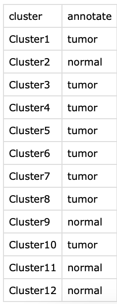

<!-- README.md is generated from README.Rmd. Please edit that file -->

```{r, include = FALSE}
knitr::opts_chunk$set(
  collapse = TRUE,
  comment = "#>",
  fig.path = "man/figures/README-",
  out.width = "100%"
)
```

# stmut: Somatic Mutation Investigation of Spatial Transcriptomics Data
***

<!-- badges: start -->
<!-- badges: end -->

Characterizing gene expression profiles throughout tissue space provides key insights in investigating biological processes and disease development, including cancer. Bioinformatic tools exploring and interpreting spatial transcriptomics data are in great need - especially, approaches to visualize point mutations, allelic imbalance, and copy number variations (CNVs). 
CNVkit is a popular toolkit used to investigate the copy number alterations in both DNA-seq and RNA-seq data. Based on [CNVkit-RNA](https://cnvkit.readthedocs.io/en/stable/rna.html) and SAMtools, we provide an R package called stmut via this github page. The stmut package includes a series of functions to visualize copy number variations (CNVs), point mutations, and allelic imbalance in spatial transcriptomics data. We also provide the [scripts producing the figures](https://github.com/limin321/stmut/blob/master/FigTableScripts/FigTables.md) in the manuscript, which also serves as a user guide for this package. In addition, this package is also applicable to 10x single cell data analyses.  <br />

The functions in the stmut package are organized into 3 parts: CNVs, point mutations, and allelic imbalance.

This package was tested using R version 4.1.1, a macOS Monterey, Apple M1, 16G Memory. Given that spatial transcriptomics data normally have more than hundreds or thousands spots, we recommend using a high performance cluster to obtain point mutation and allelic imbalance for each spot.

## Installation 
***
You can install the development version of stmut from [GitHub](https://github.com/) with:

``` r
# install.packages("devtools")
devtools::install_github("limin321/stmut")
library(stmut)
```
#### Notes 
* Bash scripts displayed in `echo` command are for your reference when you run your own data. <br />
* This package relies on previously sequenced DNAseq data, for example, exome data. That is, you need to have your bulk CNVs, germline SNPs, and somatic mutations list ready before using this package. <br />
* Prepare the following 5 files from the spaceranger pipeline output: <br />
1. filtered_feature_bc.csv <br />
2. Graph-Based.csv, this file is exported from 10X Loupe Browser as shown below. <br />

3. possorted_genome_bam.bam <br />
4. spatial/tissue_positions_list.csv <br />
5. raw_feature_bc_matrix/barcodes.tsv.gz <br />

## I. Point Mutation Detection
***
* spotIndex generation: you can also run splitSpot() to generate an individual spot barcode and gene expression file, and each file is named numerically. For example, the first spot is spot000.txt, the next is spot001.txt and so forth. <br />
```{r, eval=FALSE}
file <- read.csv("./Rep1/Data/SpacerangerOutput/CloupeFilesManualAlignment/filtered_feature_bc.csv")
splitSpot(file = file)
```
output of splitSpot(). spotIndex contains individual spot barcode txt file; txt directory contains individual spot gene expression profile.


* spotBam generation: the spot bam is generated as suggested by [10xGenomics subset-bam](https://github.com/10XGenomics/subset-bam) <br />
```{bash}
echo "subset-bam_linux --bam possorted_genome_bam.bam --cell-barcodes spot000.txt --out-bam spot000.bam"
echo "samtools index spot000.bam"
```

* Count point mutations for each spot: we count the number of ref and mut reads using Mpileup_RNA.pl script [found here](https://github.com/limin321/stmut/tree/master/FigTableScripts). This scripts takes 3 inputs as shown in the following example. The first is the somatic mutation list; the second is the spot bam file; the third is the reference fasta file, which should be the same used either SpaceRanger or CellRanger. Make sure `samtools` is installed before running: <br />
```{bash}
echo "perl Mpileup_RNA.pl Patient4SomaticSNPs.txt spot000/spot000.bam ./refdata-gex-GRCh38-2020-A/fasta/genome.fa"
```

* [spaPointMutation](https://github.com/limin321/stmut/blob/master/FigTableScripts/FigTables.md#figure-1-figure-2a) creates a folder in your working directory including 8 files related to spot point mutations exploration. The AllSptTumPropsed.csv file contains a list of point mutations for visualization on the 10X Loupe Browser. The color scheme can be customized in the 10X Loupe Browser. The figures generated should be similar to Figure 1 in our manuscript. Make sure the format of your input files  matches the examples provided by the package to ensure the smooth running of the codes. <br />


## II. Copy Number Variation Detection
***
### Docker Image download
To call copy number variation from 10X spatial or single cell data. We strongly recommend to pull our docker image from Docker Hub [here](https://hub.docker.com/search?q=limin321) <br />

We published 2 docker images, one for ubuntu(amd64), the other for MacOS (arm64). Once you pull the image,
you need to prepare 4 input files in your working dir. The 4 inputs are 
1) filtered_feature_bc.csv, 
2) Graph-Based.csv, 
3) tissue_positions_list.csv, 
4) annotate.csv. this file should look like below <br /> 


The above file 1) to 3) are spaceranger output. File 2) is exported from the Loupe browser as shown above. File 4) is a two column csv file as shown above.

After finishing preparing the 4 input files. Time to call CNVs using docker image following the examples below. <br />

The docker image is adapted to call CNVs from 2 spatial platfroms, 10X and StereoSeq. 

### 10X Platform
If your data is from 10X, you can directly follow the below code.
```
docker run --rm  -v ./stmutCNVtest/scripts/:/home/stmut/ stmutcnv:latest bash /usr/local/bin/stmutcnv.sh cnv \
    --filteredFeatureCSV ./stereo/filtered_feature_bc.csv \
    --clusterCSV ./stereo/graph_based.csv \
    --positionCSV ./stereo/tissue_positions_list.csv \
    --group gene \
    --annotate ./stereo/annotate.csv \
    --TotalReads 1000 \
    --numSpots 8
```
We provide two grouping methods, either by genes (default method, with min 1k genes per new spot) or by reads (min 5k UMI per new spot)

### StereoSeq Platform
If your data is from StereoSeq, you need to do some extra work. Here is the step by step instructions.

###### First, run the following code to generate input files similar to 10X platform.
```
docker run --rm  -v ./stmutCNVtest/scripts/:/home/stmut/ stmutcnv:latest bash /usr/local/bin/stmutcnv.sh gemconvert \
    --gemfile ./stereo/<chipID>.tissue.gem.gz \ # the output from stereo SAW pipeline.
    --binsize 200 \ # the bin_size, bin200 is assumed to similar size as 10X visium spot size.
    --outpath ./stereo/ # path to save the outputs.
```
It takes 3 arguments: the tissue.gem.gz; the bin_size, the output dir you want to store the output.

Output 4 files. <br />
    1) filtered_feature_bc.csv <br />
    2) graph_based.csv <br />
    3) tissue_positions_list.csv <br />
    4) bin200_seurat.RDS <br />
The counterfeit barcodes in each file were created to mimic the ones from 10X platform 
to keep consistent data format for analysis. The real corresponding coordinates are stored 
in the meta data of the rds. With this rds, you also need to perform clustering analysis, and annotate each cluster so as to create a annotate.csv file to run CNV analysis in the next step.

###### Second, repeat the same code as shown in the 10X Platform.


#### More cases of calling CNVs.
Case 1: group spots by number of genes when bulk tumor CNVs is available.

```
docker run -v <your_local_dir>:/home/stmut limin321/stmutcnv_arm64:0.0.1 bash /usr/local/bin/stmutcnv.sh cnv
    --filteredFeatureCSV ./filtered_feature_bc.csv 
    --clusterCSV ./Graph-Based.csv \
    --positionCSV ./tissue_positions_list.csv \
    --TotalReads 1000 \
    --numSpots 8 \
    --group gene \  
    --annotate ./annotate.csv \ 
    --arms 1p,3p,3q,4q,5q,8q,9q,10p,10q,11q,13p,13q,20p,20q,21q,14q,17q \
    --gainLoss 1,-1,1,-1,-1,1,1,-1,-1,1,-1,-1,1,1,-1,1,1
```

Expected output format: <br />
.<br />
└── spatial <br />
    ├── grouped_spots <br />
    │   ├── BarcodeLegend.csv # details on which spots are grouped into a new spot <br />
    │   ├── cdt <br />
    │   │   ├── CNVs_OrganizedByGEcluster_UMIcount.cdt <br />
    │   │   ├── CNVs_OrganizedByGEcluster_UMIcount_ChromosomeTemplate.png <br />
    │   │   ├── CNVs_OrganizedByGEcluster_UMIcount_ClusterTemplate.png <br />
    │   │   ├── CNVs_RankedBySimilarityToDNA.cdt <br />
    │   │   ├── CNVs_RankedBySimilarityToDNA_CNVscoreHistogram.csv <br />
    │   │   ├── CNVs_RankedBySimilarityToDNA_CNVscoreHistogram.pdf <br />
    │   │   ├── CNVs_RankedBySimilarityToDNA_QQplot.pdf <br />
    │   │   ├── CNVs_RankedbySimilaritytoDNA_Quintiles4Loupe.csv <br />
    │   │   ├── CNVs_clustered.Rdata <br />
    │   │   └── CNVs_clustered_heatmap.pdf <br />
    │   ├── filtered_feature_bc.csv <br />
    │   └── grouped_spotSummary.csv <br />
    └── spotSummary.csv

4 directories, 14 files

We provide three sets of outputs: <br />
CNVs_OrganizedByGEcluster_UMIcount: the three files are used to generate Fig.4 included in our paper. <br />
CNVs_RankedBySimilarityToDNA: this set is optional. Only when you provide bulk tumor CNVs data, these outputs will be generated. <br />
CNVs_clustered: we provide a dendrogram of CNVs info. The details are saved in the .Rdata which you can extract for further exploring. <br />


Case 2: group spots by number of reads without bulk tumor CNVs available <br />

```
docker run -v <your_local_dir>:/home/stmut limin321/stmutcnv_arm64:0.0.1 bash /usr/local/bin/stmutcnv.sh cnv
    --filteredFeatureCSV ./filtered_feature_bc.csv 
    --clusterCSV ./Graph-Based.csv 
    --positionCSV ./tissue_positions_list.csv 
    --TotalReads 1000 
    --numSpots 8 
    --group gene 
    --annotate ./annotate.csv
```


## III. Allelic Imbalance 
***
accumStartPos() and bulkLOHplot() functions are for generating bulk DNAseq allelic imbalance plots.

* Generate 'samtools mpileup' input of counting major- and minor- reads per mutant of each spot.
```{r, eval=FALSE}
# Tumor SNPs list
data1 <- read.table(file = "/Volumes/Bastian/Limin/Ji_data/Patient6/BulkDNASeq/LOH/MpileupOutput_TumorConverted.txt", sep = "\t",quote = "", header = TRUE)

# generate "samtools mpileup" input for counting major and minor alleles per mutant of each Spot
lohMpileupInput(data1 = data1) # the LOHmpileupInput.txt file will generate in your working dir
```
In our cases, the patient4_hg38_SNPs.txt and patient6_hg38_SNPs.txt files, which can be found [here](https://github.com/limin321/stmut/blob/master/VisualizingSomaticAlterations/DNAseqResourceFiles/), are used to count the # of major and minor alleles of each spot in patient4 and patient6.


* Counting the # of majorAllele- and minorAllele- reads per mutant of each spot.
The script Mpileup_RNA_alleImbalance.pl can be downloaded [here](https://github.com/limin321/stmut/tree/master/FigTableScripts)
```{bash}

echo "perl ./Mpileup_RNA_alleImbalance.pl ./LOHmpileupInput.txt spot000/spot000.bam"

```

* Generate a summary table of all spot major/minor allele counts of all spots.
```{r, eval=FALSE}
files <- c("/Volumes/Bastian/Limin/Ji_data/Patient6/SpatialTranscriptomic/Rep1/LOH/allelicImbalance2/mpileupOutput/spot0001/MpileupOutput_RNA.txt","/Volumes/Bastian/Limin/Ji_data/Patient6/SpatialTranscriptomic/Rep1/LOH/allelicImbalance2/mpileupOutput/spot0002/MpileupOutput_RNA.txt")

x <- files[1]
y = match("spot0001",str_split_fixed(x,"/",15)) # 12

lohMajorAlleleCt(files = files, y=12)

```
The output is 2 csv files: SNPallMajorAlleleCount.csv and SNPMajorAlleleCount.csv. The latter is used to generate Figures in the manuscript. <br />


* Scripts generating the allelic imbalance figures(Figure 4 and Figure S6) in the manuscript can be found [here](https://github.com/limin321/stmut/blob/master/FigTableScripts/FigTables.md#bulk-dnaseq-allelic-imbalance)


```{r, include=FALSE}
# You'll still need to render `README.Rmd` regularly, to keep `README.md` up-to-date. `devtools::build_readme()` is handy for this. You could also use GitHub Actions to re-render `README.Rmd` every time you push. An example workflow can be found here: <https://github.com/r-lib/actions/tree/v1/examples>.
```


```{r}
sessionInfo()
```


