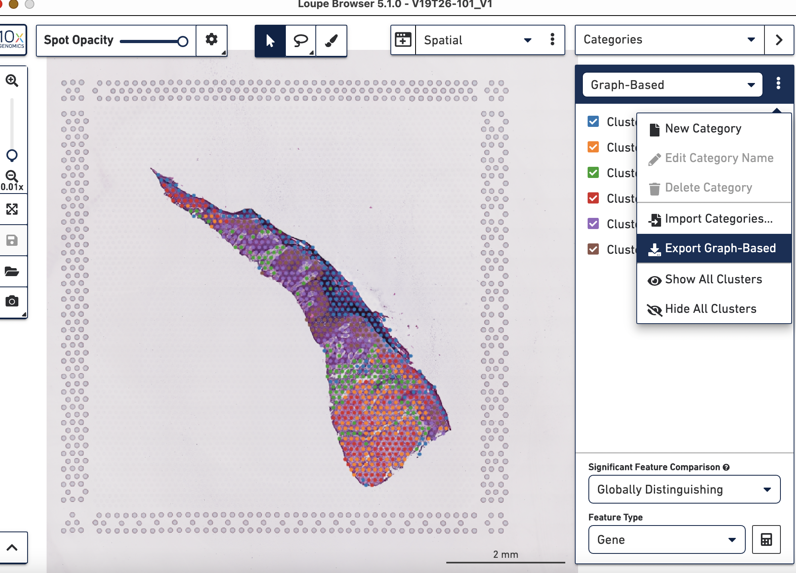
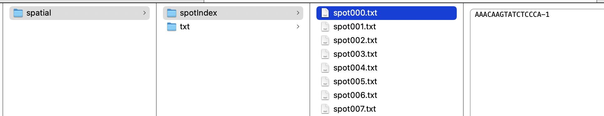

<!-- README.md is generated from README.Rmd. Please edit that file -->

```{r, include = FALSE}
knitr::opts_chunk$set(
  collapse = TRUE,
  comment = "#>",
  fig.path = "man/figures/README-",
  out.width = "100%"
)
```

# stmut: Somatic Mutation Investigation of Spatial Transcriptomics Data
***

<!-- badges: start -->
<!-- badges: end -->

Characterizing gene expression profiles throughout tissue space provides key insights in investigating biological processes and disease development, including cancer. Bioinformatic tools exploring and interpreting spatial transcriptomics data are in great need - especially, approaches to visualize point mutations, allelic imbalance, and copy number variations (CNVs). 
CNVkit is a popular toolkit used to investigate the copy number alterations in both DNA-seq and RNA-seq data. Based on [CNVkit-RNA](https://cnvkit.readthedocs.io/en/stable/rna.html) and SAMtools, we provide an R package called stmut via this github page. The stmut package includes a series of functions to visualize copy number variations (CNVs), point mutations, and allelic imbalance in spatial transcriptomics data. We also provide the [scripts producing the figures](https://github.com/limin321/stmut/blob/master/FigTableScripts/FigTables.md) in the manuscript, which also serves as a user guide for this package. In addition, this package is also applicable to 10x single cell data analyses.  <br />

The functions in the stmut package are organized into 3 parts: CNVs, point mutations, and allelic imbalance.

This package was tested using R version 4.1.1, a macOS Monterey, Apple M1, 16G Memory. Given that spatial transcriptomics data normally have more than hundreds or thousands spots, we recommend using a high performance cluster to obtain point mutation and allelic imbalance for each spot.

## Installation 
***
You can install the development version of stmut from [GitHub](https://github.com/) with:

``` r
# install.packages("devtools")
devtools::install_github("limin321/stmut")
library(stmut)
```
#### Notes 
* Bash scripts displayed in `echo` command are for your reference when you run your own data. <br />
* This package relies on previously sequenced DNAseq data, for example, exome data. That is, you need to have your bulk CNVs, germline SNPs, and somatic mutations list ready before using this package. <br />
* Prepare the following 5 files from the spaceranger pipeline output: <br />
1. filtered_feature_bc.csv <br />
2. Graph-Based.csv, this file is exported from 10X Loupe Browser as shown below. <br />

3. possorted_genome_bam.bam <br />
4. spatial/tissue_positions_list.csv <br />
5. raw_feature_bc_matrix/barcodes.tsv.gz <br />

## I. Point Mutation Detection
***
* spotIndex generation: you can also run splitSpot() to generate an individual spot barcode and gene expression file, and each file is named numerically. For example, the first spot is spot000.txt, the next is spot001.txt and so forth. <br />
```{r, eval=FALSE}
file <- read.csv("./Rep1/Data/SpacerangerOutput/CloupeFilesManualAlignment/filtered_feature_bc.csv")
splitSpot(file = file)
```
output of splitSpot(). spotIndex contains individual spot barcode txt file; txt directory contains individual spot gene expression profile.



* spotBam generation: the spot bam is generated as suggested by [10xGenomics subset-bam](https://github.com/10XGenomics/subset-bam) <br />
```{bash}
echo "subset-bam_linux --bam possorted_genome_bam.bam --cell-barcodes spot000.txt --out-bam spot000.bam"
echo "samtools index spot000.bam"
```

* Count point mutations for each spot: we count the number of ref and mut reads using Mpileup_RNA.pl script [found here](https://github.com/limin321/stmut/tree/master/FigTableScripts). This scripts takes 3 inputs as shown in the following example. The first is the somatic mutation list; the second is the spot bam file; the third is the reference fasta file, which should be the same used either SpaceRanger or CellRanger. Make sure `samtools` is installed before running: <br />
```{bash}
echo "perl Mpileup_RNA.pl Patient4SomaticSNPs.txt spot000/spot000.bam ./refdata-gex-GRCh38-2020-A/fasta/genome.fa"
```

* [spaPointMutation](https://github.com/limin321/stmut/blob/master/FigTableScripts/FigTables.md#figure-1-figure-2a) creates a folder in your working directory including 8 files related to spot point mutations exploration. The AllSptTumPropsed.csv file contains a list of point mutations for visualization on the 10X Loupe Browser. The color scheme can be customized in the 10X Loupe Browser. The figures generated should be similar to Figure 1 in our manuscript. Make sure the format of your input files  matches the examples provided by the package to ensure the smooth running of the codes. <br />

#### Examples of running individual functions
The following are basic examples on how to run each individual function:
1. sptBClstRds()
```{r example}
library(stmut)
## basic example code
files <- list.files(path = "./inst/extdata/spotIndex", pattern = ".txt", full.names = TRUE, recursive = FALSE)
data1 <- read.csv("./inst/extdata/filtered_feature_bc.csv", header = TRUE)
data2 <- read.csv("./inst/extdata/Graph-Based.csv", header = TRUE)
path <- "./inst/extdata/tissue_positions_list.csv"

df <- sptBClstRds(files=files,data1=data1, data2=data2, path=path)

head(df[[1]]) # sptBcRds.csv
head(df[[2]]) # sptBcSummary.csv
```

2. sptMutCt()
```{r example2}
index <- read.csv("./inst/extdata/spotBC.csv", header = TRUE)
files2 <- list.files(path = "./inst/extdata/mpileup",pattern = "MpileupOutput_RNA.txt", full.names = TRUE, recursive = TRUE, include.dirs = TRUE)
df1 <- sptMutCt(index = index, files = files2)

head(df1[[1]]) # spotRdCtFinal.csv
head(df1[[2]]) # spotMutReadCount.csv
```

3. nonZeRdCts()
```{r example3}
d1 <- read.csv("./inst/extdata/spotBClster.csv", header = TRUE)
d2 <- read.csv("./inst/extdata/spotRdCtFinal.csv", header = TRUE)
d2 <- na.omit(d2)

df3 <- nonZeRdCts(df1 = d1, df2 = d2)
head(df3[[1]]) # NonZeroRdSpotIndex.csv
head(df3[[2]]) # MutantSpotIndex.csv
```

4. spotSummary()
```{r example4}
df <- read.csv("./inst/extdata/NonZeroRdSpotIndex.csv", header = TRUE)
path1 <-"./inst/extdata/mpileup/"

df4 <- spotSummary(df = df, path1 = path1)

head(df4) # NonZeroRdSpotIndex_Scored.csv
```
Column meaning of df4: <br />
column 1: Spatial barcode <br />
column 2: Spot name <br />
column 3: Cluster in Loupe.Loupe file <br />
column 4: Total reads each spot has <br />
column 5: Row position in position_lists_bc.csv <br />
column 6: Column position in position_lists_bc.csv <br />
column 7: Reference read counts <br />
column 8: Mutant read counts <br />
column 9: Sum of Ref read counts and Mut read counts (sum of col 7 and col 8) <br />
column 10: The number ( < 10) in this column indicates how many mutant reads in a spot. For example, G9 means there are 9 mutant reads in that spot. However, G10 means there are10 or more mutant reads in the spot. <br />
column 11: Proportion of # of mutant reads to Total reads (col8/col4) <br />
column 12: Proportion of # of mutant reads to sum of ref and mut reads (col8/col9) <br />
column 13: A binary column, when the spot has > 1 mutant read, it is 1, otherwise, it is 0. <br />
column 14: A score calculated based on the # of ref and mutant read counts. The higher the score is, the more likely it is a tumor spot. The table is sorted by this column. <br />
column 15: Details on which genes contain what mutations in which spots. <br />

## II. Copy Number Variation Detection
***
accStartCNR_CNS() and bulkCNVs() functions are used to generate arm-level bulk CNVs plot. <br />
wtArmMedianOne(), CtArmGenes() and cdt_filt_sort() functions are used in generating spot CNVs heatmap. Kindly refer to the case study in our manuscript FigTableScripts [here](https://github.com/limin321/stmut/blob/master/FigTableScripts/FigTables.md#spatial-spot-cnvs-figure-3) <br />

Here are examples on how to run the following functions: <br />
1. wtArmMedianOne()
```{r}
df <- read.csv("./inst/extdata/spot1_rep1.cnr", header = TRUE)
path1 <- read.csv("./inst/extdata/hg38_centromereSimple.bed", sep = "\t", header = FALSE) 

df5 <- wtArmMedianOne(data = cnr, centmere = centm)

head(df5[[1]])
head(df5[[2]])
```
2. CtArmGenes()
```{r}
cdt <- read.table("./inst/extdata/cdt.cdt", header = TRUE)
d3 <- read.table("./inst/extdata/summary.txt", sep = "\t", header = TRUE) 

df6 <- CtArmGenes(cdt = cdt, data = d3)

head(df6)
```

3. cdt_filt_sort()
```{r}
library(dplyr)
cdt <- read.table("./inst/extdata/cdt.cdt", header = TRUE)
data4 <- read.csv("./inst/extdata/CtArmGenSummary.csv",  header = TRUE)
arm <- c("1p","3p","3q","4q","5q","8q","9q","10p","10q","11q","13p","13q", "20p","20q","21q","14q","17q")
d4 <- data4 %>% filter(arms %in% arm)
genes <- d4[,"genes"]
rs <- d4[,"gene_row"]
gainLoss <- c(1,-1,1,-1,-1,1,1,-1,-1,1,-1,-1,1,1,-1,1,1)

df7 <- cdt_filt_sort(cdt = cdt,genes = genes,gainLoss = gainLoss,rs=rs)

head(df7)
```

4. cnvs()
```{r, eval=FALSE}
# data1: annotation data. A 2 column dataframe with column names as "spotName" and "annotate". Also, the annotate column must have "normal" cells or spots which will be used to center the data.
# cdt file is the weighted median cdt file generated by cnvkit.py.
# data2 is the output of wtArmMedianOne() function stored in the wtcnr/summary.txt

cnvs(data1 = data1, cdt = cdt0, data2 = data2, arm = arm, gainLoss = gainLoss) # the output is CNVs.cdt in your working directory.
```


## III. Allelic Imbalance 
***
accumStartPos() and bulkLOHplot() functions are for generating bulk DNAseq allelic imbalance plots.

* Generate 'samtools mpileup' input of counting major- and minor- reads per mutant of each spot.
```{r, eval=FALSE}
# Tumor SNPs list
data1 <- read.table(file = "/Volumes/Bastian/Limin/Ji_data/Patient6/BulkDNASeq/LOH/MpileupOutput_TumorConverted.txt", sep = "\t",quote = "", header = TRUE)

# generate "samtools mpileup" input for counting major and minor alleles per mutant of each Spot
lohMpileupInput(data1 = data1) # the LOHmpileupInput.txt file will generate in your working dir
```
In our cases, the patient4_hg38_SNPs.txt and patient6_hg38_SNPs.txt files, which can be found [here](https://github.com/limin321/stmut/blob/master/VisualizingSomaticAlterations/DNAseqResourceFiles/), are used to count the # of major and minor alleles of each spot in patient4 and patient6.


* Counting the # of majorAllele- and minorAllele- reads per mutant of each spot.
The script Mpileup_RNA_alleImbalance.pl can be downloaded [here](https://github.com/limin321/stmut/tree/master/FigTableScripts)
```{bash}

echo "perl ./Mpileup_RNA_alleImbalance.pl ./LOHmpileupInput.txt spot000/spot000.bam"

```

* Generate a summary table of all spot major/minor allele counts of all spots.
```{r, eval=FALSE}
files <- c("/Volumes/Bastian/Limin/Ji_data/Patient6/SpatialTranscriptomic/Rep1/LOH/allelicImbalance2/mpileupOutput/spot0001/MpileupOutput_RNA.txt","/Volumes/Bastian/Limin/Ji_data/Patient6/SpatialTranscriptomic/Rep1/LOH/allelicImbalance2/mpileupOutput/spot0002/MpileupOutput_RNA.txt")

x <- files[1]
y = match("spot0001",str_split_fixed(x,"/",15)) # 12

lohMajorAlleleCt(files = files, y=12)

```
The output is 2 csv files: SNPallMajorAlleleCount.csv and SNPMajorAlleleCount.csv. The latter is used to generate Figures in the manuscript. <br />


* Scripts generating the allelic imbalance figures(Figure 4 and Figure S6) in the manuscript can be found [here](https://github.com/limin321/stmut/blob/master/FigTableScripts/FigTables.md#bulk-dnaseq-allelic-imbalance)


```{r, include=FALSE}
# You'll still need to render `README.Rmd` regularly, to keep `README.md` up-to-date. `devtools::build_readme()` is handy for this. You could also use GitHub Actions to re-render `README.Rmd` every time you push. An example workflow can be found here: <https://github.com/r-lib/actions/tree/v1/examples>.
```

